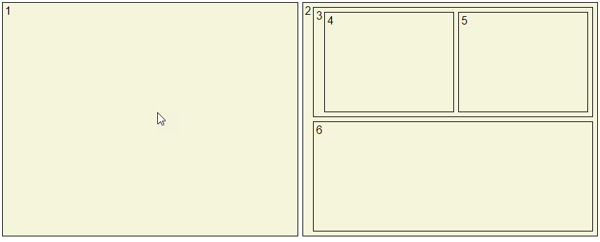
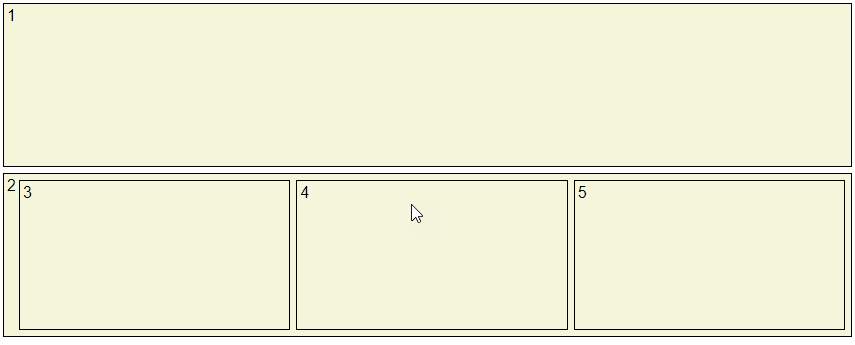

## Base CSS Layout

When I am doing tests and demos I'm always going crazy doing the css and always want to maintain it small and clean. 

This is a small base css (less 40 lines) thats does just what I need in those cases

Enjoy.

- use 100% of screen
- easy divide between rows and cols layouts

#### Flexa Cols Layout

```html
    <div class="container">
      <span class="cols">
        <span class="box">  
          1           
        </span>
        <span class="box">                             
          2        
          <span class="rows">
            <span class="box">
              3
              <span class="cols">
                <span class="box">4</span>
                <span class="box">5</span>
              </span>
            </span>
            <span class="box">6</span>
          </span>
        </span>        
      </span>
    </div>
```



#### Flexa Rows Layout

```html
 <div class="container">
      <span class="rows">               
        <span class="box">  
          1           
        </span>
        <span class="box">  
          2           
          <span class="cols">
            <span class="box">3</span>
            <span class="box">4</span>
            <span class="box">5</span>
          </span>
        </span>
      </span>
 </div>
```

 
### Maintainers

[csegura](https://github.com/csegura).

You can follow me on twitter: [@romheat](https://www.twitter.com/romheat)

### Contributing

Feel free to dive in! [Open an issue](https://github.com/csegura/flexa/issues/new) or submit PRs.

### License

[MIT](LICENSE) © carlos segura